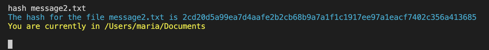

# Node.js CLI File Manager

## Description

This is a CLI File Manager based on Node.js APIs.

The file manager is able to do the following:

- Work using CLI
- Perform basic file operations (create, copy, move, delete, rename, etc.)
- Utilize Streams API
- Get information about the host machine operating system
- Calculate the hash for a given file
- Compress and decompress files

## Technical requirements

- No external dependencies are required
- Clone the repository by `git clone https://github.com/mlatysheva/nodejs_cli-file-manager.git`
- `cd` into the cloned repository.
- Use 18 LTS version of Node.js
- Start the program by running:
```bash
npm run start -- --username=your_username
```
- After starting the program displays the following text in the console (`Username` is equal to value that was passed on application start in `--username` CLI argument)  
`Welcome to the File Manager, Username!`  


- After the program work finished (`ctrl + c` pressed or the user sent the `.exit` command to the console), the program displays the following text in the console:  
`Thank you for using File Manager, Username, good-bye!`  


- At the start of the program and after each end of input/operation the current working directory is printed in following way:  
`You are currently in path_to_working_directory`  
- The starting working directory is the current user's home directory (for example, on Windows it's something like `system_drive/Users/Username`)
- By default, the program prompts the user in the console to print commands and wait for results 
- By typing `help` the user can see the list of available commands

- In case of an unknown operation or invalid input (missing mandatory arguments, wrong data in the arguments, etc.), the `Invalid input` message is shown and the user is able to enter another command
- In case of an error during execution of an operation, the `Operation failed` message is shown and the user is able to enter another command (e.g. an attempt to perform an operation on a non-existent file or work on a non-existent path results in the operation fail)
- The user cannot go upper than the root directory (e.g. on Windows it's the current local drive root). If the user tries to do so, the current working directory does not change  

The list of operations and their syntax:
- Navigation & working directory (nwd)
    - Go up from the current directory (when you are in the root folder, this operation does not change the working directory)  
    ```bash
    up
    ```
    - Go to a dedicated folder from the current directory (`path_to_directory` can be relative or absolute)
    ```bash
    cd path_to_directory
    ```
    - Print into the console the list of all files and folders in the current directory. The list contains:
        - the names of the files and folders (for files - with the extension)
        - the folders and files are sorted in the alphabetical order ascending, but the list of folders goes first
        - the type of the content in a directory is marked explicitly (as a corresponding column value)
    ```bash
    ls
    ```
    
- Basic operations with files
    - Read a file and print its content into the console (is implemented with the Readable stream): 
    ```bash
    cat path_to_file
    ```
    - Create an empty file in the current working directory: 
    ```bash
    add new_file_name
    ```
    - Rename a file (the content is remained unchanged): 
    ```bash
    rn path_to_file new_filename
    ```
    - Copy a file (is implemented using Readable and Writable streams): 
    ```bash
    cp path_to_file path_to_new_directory
    ```
    

    

    - Move a file (same as the `copy` but the initial file is deleted, the copying part is done with Readable and Writable streams): 
    ```bash
    mv path_to_file path_to_new_directory
    ```
    - Delete a file: 
    ```bash
    rm path_to_file
    ```
    

- Operating system info (prints the following information into the console)
    - Get EOL (default system End-Of-Line) and print it to console  
    ```bash
    os --EOL
    ```
    - Get the host machine CPUs info (the total amount of CPUS plus the model and clock rate (in GHz) for each of them) and print it into the console  
    ```bash
    os --cpus
    ```
    - Get the home directory and print it to the console  
    ```bash
    os --homedir
    ```
    - Get the current *system user name* and print it to the console  
    ```bash
    os --username
    ```
    - Get the CPU architecture for which the Node.js binary was compiled and print it to the console  
    ```bash
    os --architecture
    ```
- Hash calculation  
    - Calculate the hash for a file and print it into the console  
    ```bash
    hash path_to_file
    ```
    

- Compress and decompress operations  
    - Compress a file (the Brotli algorithm and Streams API are used)  
    ```bash
    compress path_to_file path_to_destination
    ```
    
    - Decompress a file (the Brotli algorithm and Streams API are used)  
    ```bash
    decompress path_to_file path_to_destination
    ```  
    

- If `path_to_destination` is not indicated, the corresponding operation (`cp`, `compress` or `decompress` a file) is performed in the same directory as the original file. If copying is taking place, the string `_copy` is added to the filename before its extension.